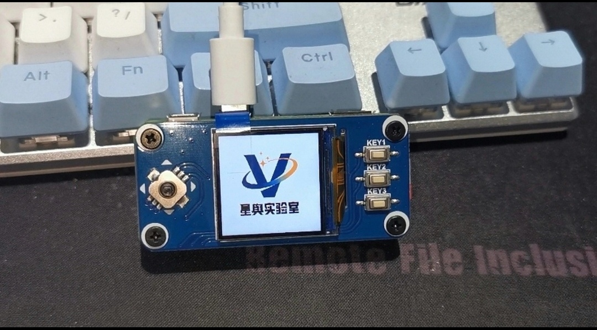
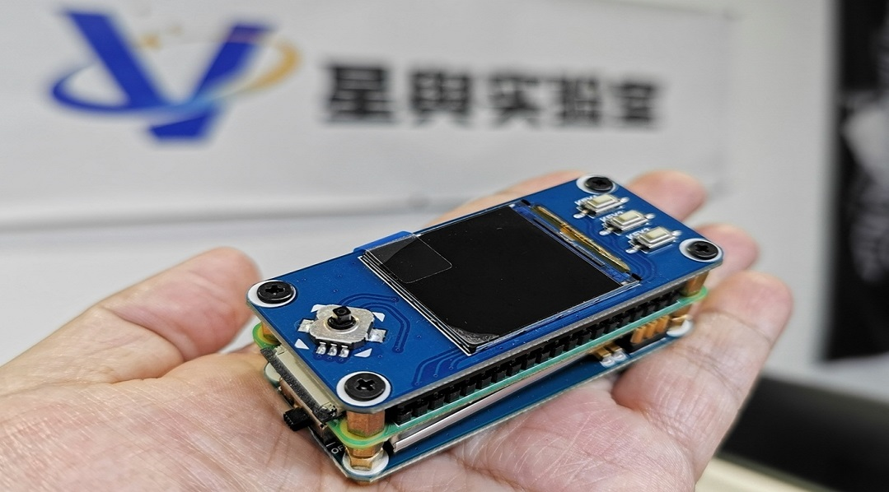

# InfinityPI

The InfinityPI is designed to be used as a hardware toolkit during vehicle pen-testing scenarios, where we want it to be portable and stealthy.
 
There are different hardware modules, that can be added to the InfinityPI for various tasks. The InfinityPI made up of a collection of pen-testing tools, enables it to perform the functions such as door unlocking,
 BLE relay attack, and CAN packet manipulating. 

 
 

With InfinityPI a pentester can sniff and manipulate the CAN packets. It can be used as an entry point to a target vehicle. Once connected to the OBD2 Port, 
the scripts will run and perform in-depth CAN network analysis.
 
The attack exploits performed by InfinityPI are automated, once activated it will automatically exploit vulnerable services that can be exploited. 
The reporting feature on InfinityPI gives the pentester the option of sending reports in PDF formats.

 

# Demo
·InfinityPI Demo for Summoning the Tesla 

https://user-images.githubusercontent.com/121275881/209303645-e2651a63-7e7b-4dbf-aa10-30e8ebc58668.mp4

 
·InfinityPI Demo for Whitelist attack the Tesla
  

https://user-images.githubusercontent.com/121275881/209305532-92c78d0a-abe7-45ef-8d4b-ccf2a0f53efa.mp4

# NEWS

# Developers
shen jian -[https://github.com/SmileJJJ](https://github.com/SmileJJJ)  
li siwei -[https://github.com/vajic](https://github.com/vajic)  
chen huajiang -[https://twitter.com/kevin2600](https://twitter.com/kevin2600)  